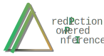

Prediction-powered inference (PPI) is a framework for statistically rigorous scientific discovery using machine learning.
Given a small amount of data with gold-standard labels and a large amount of unlabeled data, prediction-powered inference allows for the estimation of population parameters, such as the mean outcome, median outcome, linear and logistic regression coefficients.
Prediction-powered inference can be used both to produce better point estimates of these quantities as well as tighter confidence intervals and more powerful p-values.
The methods work both in the i.i.d. setting and for certain classees of distribution shifts.

This package is actively maintained, and contributions from the community are welcome.

# Getting Started 
In order to install the package, run 
```python
python setup.py sdist bdist_wheel
pip install dist/ppi_py-0.1-py3-none-any.whl
```
This will build and install the most recent version of the package.

## Warmup: estimating the mean

To test your installation, you can try running the prediction-powered mean estimation algorithm on the ```galaxies``` dataset.
The gold-standard labels and model predictions from the dataset will be downloaded into a folder called `./data/`.
The labels, $Y$, are binary indicators of whether or not the galaxy is a spiral galaxy.
The model predictions, $\hat{Y}$, are the model's estimated probability of whether the galaxy image has spiral arms.
The inference target is $\theta = \mathbb{E}[Y]$, the fraction of spiral galaxies.
We will produce a confidence interval, $\mathcal{C}^{\mathrm{PP}}_\alpha$, which contains $\theta$ with probability $1-\alpha=90\%$, i.e.,
```math
    \mathbb{P}\left( \theta \in \mathcal{C}^{\mathrm{PP}}_\alpha\right) \geq 90\%.
```

The code for this is below. It can be copy-pasted directly into the Python REPL.
```python
# Imports
import numpy as np
from ppi_py import ppi_mean_ci
from ppi_py.datasets import load_dataset
np.random.seed(0) # For reproducibility's sake
# Download and load dataset
data = load_dataset('./data/', "galaxies")
Y_total = data["Y"]; Yhat_total = data["Yhat"]
# Set up the inference problem
alpha = 0.1 # Error rate
n = 1000 # Number of labeled data points
rand_idx = np.random.permutation(Y_total.shape[0])
Yhat = Yhat_total[rand_idx[:n]]
Y = Y_total[rand_idx[:n]]
Yhat_unlabeled = Yhat_total[n:]
# Produce the prediction-powered confidence interval
ppi_ci = ppi_mean_ci(Y, Yhat, Yhat_unlabeled, alpha=alpha)
# Print the results
print(f"theta={Y_total.mean():.3f}, CPP={ppi_ci}")
```

The expected results look as below $^*$: 
```
theta=0.259, CPP=(0.235677274705698, 0.26595223970754855)
```
($^*$ these results were produced with ```numpy=1.26.0```, and may differ slightly due to randomness in other environments.)

If you have reached this stage, congratulations! You have constructed a prediction-powered confidence interval.
See [the documentation]() for more usages of prediction powered inference.

# Examples

The package somes with a suite of examples on real data:
- Proteomic Analysis with AlphaFold ([```alphafold.ipynb```](https://github.com/aangelopoulos/ppi_py/blob/main/examples/alphafold.ipynb))
- Galaxy Classification with Computer Vision ([```galaxies.ipynb```](https://github.com/aangelopoulos/ppi_py/blob/main/examples/galaxies.ipynb))
- Gene Expression Analysis with Transformers ([```gene_expression.ipynb```](https://github.com/aangelopoulos/ppi_py/blob/main/examples/gene_expression.ipynb))
- Deforestation Analysis with Computer Vision ([```forest.ipynb```](https://github.com/aangelopoulos/ppi_py/blob/main/examples/forest.ipynb))
- Health Insurance Analysis with Boosting Trees ([```census_healthcare.ipynb```](https://github.com/aangelopoulos/ppi_py/blob/main/examples/census_healthcare.ipynb))
- Income Analysis with Boosting Trees (covariate shift) ([```census_income_covshift.ipynb```](https://github.com/aangelopoulos/ppi_py/blob/main/examples/census_income_covshift.ipynb))
- Plankton Counting with Computer Vision (label shift) ([```plankton.ipynb```](https://github.com/aangelopoulos/ppi_py/blob/main/examples/plankton.ipynb))
- Ballot Counting with Computer Vision ([```ballots.ipynb```](https://github.com/aangelopoulos/ppi_py/blob/main/examples/ballots.ipynb))
- Income Analysis with Boosting Trees ([```census_income.ipynb```](https://github.com/aangelopoulos/ppi_py/blob/main/examples/census_income.ipynb))

# Usage
Coming soon!

# Repository structure
 
# Documentation
Coming soon!

# Contributing
Thank you so much for reaching out! It's the collective efforts of the open-source community that make it such a vibrant and enriching space for everyone. Every contribution you make radiates positive impact, and we deeply value and appreciate it. Keep the spirit alive!

The contents of this repository will be pushed to PyPI whenever there are substantial revisions. If there are methods or examples within the PPI framework you'd like to see implemented, feel free to suggest them on the [issues page](https://github.com/aangelopoulos/ppi_py/issues). Community contributions are welcome and encouraged as pull requests directly onto the main branch. The main criteria for accepting such pull requests is:
- The contribution should align with the repository's scope.
- All new functionality should be tested for correctness within our existing ```pytest``` framework. 
- If the pull request involves a new PPI method, it should have a formal mathematical proof of validity which can be referenced.
- If the pull request solves a bug, there should be a reproducible bug (within a specific environment) that is solved. Bug reports can be made on the issues page.
- The contribution should be [well documented](https://cookbook.openai.com/what_makes_documentation_good).
- The pull request should be of generally high quality, up to the review of the repository maintainers. 
The repository maintainers will approve pull requests at their discretion. Before working on one, it may be helpful to post a question on the issues page to verify if the contribution would be a good candidate for merging into the main branch.

Accepted pull requests will be run through an automated (Black)[https://black.readthedocs.io/en/stable/] formatter, so contributors may want to run Black locally first.
